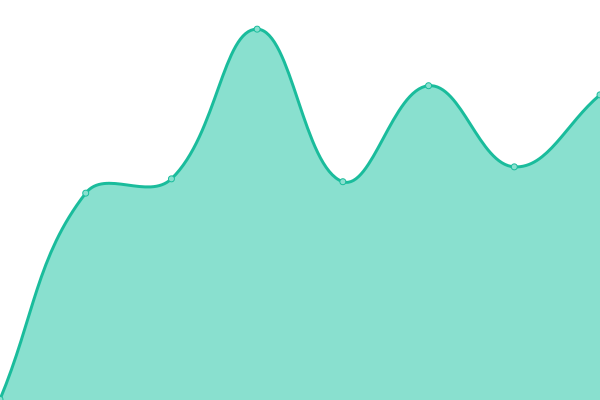

# [📈 Live Status](https://lewisgilldotcom.github.io/uptime-tracker): <!--live status--> **🟥 Complete outage**

This repository contains the open-source uptime monitor and status page for [lewisgilldotcom](lewisgill.com), powered by [Upptime](https://github.com/upptime/upptime).

With [Upptime](https://upptime.js.org), you can get your own unlimited and free uptime monitor and status page, powered entirely by a GitHub repository. We use [Issues](https://github.com/lewisgilldotcom/uptime-tracker/issues) as incident reports, [Actions](https://github.com/lewisgilldotcom/uptime-tracker/actions) as uptime monitors, and [Pages](https://lewisgilldotcom.github.io/uptime-tracker) for the status page.

<!--start: status pages-->
<!-- This summary is generated by Upptime (https://github.com/upptime/upptime) -->
<!-- Do not edit this manually, your changes will be overwritten -->
<!-- prettier-ignore -->
| URL | Status | History | Response Time | Uptime |
| --- | ------ | ------- | ------------- | ------ |
|  [lewisgill.com](https://lewisgill.com) | 🟥 Down | [lewisgill-com.yml](https://github.com/lewisgilldotcom/uptime-tracker/commits/HEAD/history/lewisgill-com.yml) | 

 474ms
     
 | 

<a href="https://status.lewisgill.com/history/lewisgill-com">99.96%</a>
    

|  [LDDDS (TF2)](77.68.48.198) | 🟥 Down | [lddds-tf-2.yml](https://github.com/lewisgilldotcom/uptime-tracker/commits/HEAD/history/lddds-tf-2.yml) | 

 103ms
     
 | 

<a href="https://status.lewisgill.com/history/lddds-tf-2">99.97%</a>
    

|  [Minecraft Server (Domain resolution)](play.lewisgill.com) | 🟥 Down | [minecraft-server-domain-resolution.yml](https://github.com/lewisgilldotcom/uptime-tracker/commits/HEAD/history/minecraft-server-domain-resolution.yml) | 

 93ms
     
 | 

<a href="https://status.lewisgill.com/history/minecraft-server-domain-resolution">99.99%</a>
    

|  [Minecraft Server (Direct)](88.208.226.170) | 🟥 Down | [minecraft-server-direct.yml](https://github.com/lewisgilldotcom/uptime-tracker/commits/HEAD/history/minecraft-server-direct.yml) | 

 93ms
     
 | 

<a href="https://status.lewisgill.com/history/minecraft-server-direct">100.00%</a>
    

<!--end: status pages-->

[**Visit our status website →**](https://lewisgilldotcom.github.io/uptime-tracker)

## 📄 License

- Powered by: [Upptime](https://github.com/upptime/upptime)
- Code: [MIT](./LICENSE) © [lewisgilldotcom](lewisgill.com)
- Data in the `./history` directory: [Open Database License](https://opendatacommons.org/licenses/odbl/1-0/)
